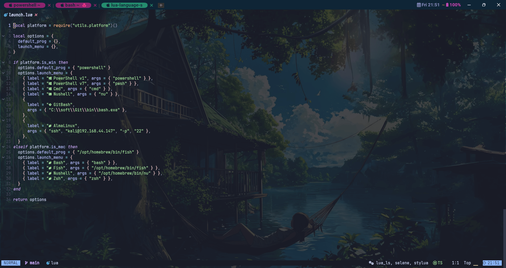

# AstroNvim-neovim-install
AstroNvim-neovim-install autoinstall AstroNvim

 


# Config

The configuration file repository can be found here

**<font color=red>AstroNvim \< 4.0: </font>**<https://github.com/QianSong1/AstroNvim-user>

**<font color=red>AstroNvim \> 4.0: </font>**<https://github.com/QianSong1/AstroNvim-config>


# Usage

## For Linux

**Requirement**

1.[`Nerd font`](https://www.nerdfonts.com/font-downloads) - (*Optional with manual intervention:* See [Recipes/Customizing Icons](https://docs.astronvim.com/recipes/icons#disable-icons))

2.[`Neovim v0.9+`](https://github.com/neovim/neovim/releases/tag/stable)

3.[`ripgrep`](https://github.com/BurntSushi/ripgrep) \- live grep telescope search (`<Leader>fw`)

```bash
# install ripgrep
╰─ cd /tmp
╰─ wget https://github.com/BurntSushi/ripgrep/releases/download/13.0.0/ripgrep-13.0.0-x86_64-unknown-linux-musl.tar.gz
╰─ tar -xf ripgrep-13.0.0-x86_64-unknown-linux-musl.tar.gz
╰─ cp -r ripgrep-13.0.0-x86_64-unknown-linux-musl/rg /usr/local/bin
╰─ ll /usr/local/bin
总计 36M
-rwxr-xr-x 1 root root            5.1M  9月 2日 18:13 rg
```

4.[`lazygit`](https://github.com/jesseduffield/lazygit) \- git ui toggle terminal (`<Leader>tl` or `<Leader>gg`)

```bash
# install lazygit
╰─ cd /tmp
╰─ wget https://github.com/jesseduffield/lazygit/releases/download/v0.40.2/lazygit_0.40.2_Linux_x86_64.tar.gz
╰─ tar xf lazygit_0.40.2_Linux_x86_64.tar.gz
╰─ sudo install lazygit /usr/local/bin
╰─ ll /usr/local/bin
-rwxr-xr-x 1 root root             16M  9月 2日 18:18 lazygit
-rwxr-xr-x 1 root root            5.1M  9月 2日 18:13 rg
```

5.[`go DiskUsage`](https://github.com/dundee/gdu) \- disk usage toggle terminal (`<Leader>tu`)

```bash
# install gdu
╰─ cd /tmp
╰─ wget https://github.com/dundee/gdu/releases/download/v5.25.0/gdu_linux_amd64.tgz
╰─ tar xf gdu_linux_amd64.tgz
╰─ \cp -rf gdu_linux_amd64 /usr/local/bin/gdu
╰─ ll /usr/local/bin
-rwxr-xr-x 1 kali kali             11M  9月 2日 18:21 gdu
-rwxr-xr-x 1 root root             16M  9月 2日 18:18 lazygit
-rwxr-xr-x 1 root root            5.1M  9月 2日 18:13 rg
```

6.[`bottom`](https://github.com/ClementTsang/bottom) \- process viewer toggle terminal (`<Leader>tt`)

```bash
# install bottom
╰─ cd /tmp
╰─ wget https://github.com/ClementTsang/bottom/releases/download/0.9.6/bottom_x86_64-unknown-linux-gnu.tar.gz
╰─ tar xf bottom_x86_64-unknown-linux-gnu.tar.gz 
╰─ \cp -rf btm /usr/local/bin/btm
╰─ ll /usr/local/bin
总计 36M
-rwxr-xr-x 1 1001 systemd-network 4.6M  9月 2日 18:28 btm
-rwxr-xr-x 1 kali kali             11M  9月 2日 18:21 gdu
-rwxr-xr-x 1 root root             16M  9月 2日 18:18 lazygit
-rwxr-xr-x 1 root root            5.1M  9月 2日 18:13 rg
```

7.[`Tree-sitter CLI`](https://github.com/tree-sitter/tree-sitter/blob/master/cli/README.md) - (*Note:* This is only necessary if you want to use `auto_install` feature with Treesitter)

```bash
# install tree-sitter
╰─ cd /tmp
╰─ wget https://github.com/tree-sitter/tree-sitter/releases/download/v0.20.8/tree-sitter-linux-x64.gz
╰─ gunzip tree-sitter-linux-x64.gz
╰─ mv tree-sitter-linux-x64 tree-sitter
╰─ chmod +x tree-sitter
╰─ \cp -rf tree-sitter /usr/local/bin/tree-sitter
╰─ ll /usr/local/bin
总计 48M
-rwxr-xr-x 1 1001 systemd-network 4.6M  9月 2日 18:28 btm
-rwxr-xr-x 1 kali kali             11M  9月 2日 18:21 gdu
-rwxr-xr-x 1 root root             16M  9月 2日 18:18 lazygit
-rwxr-xr-x 1 root root            5.1M  9月 2日 18:13 rg
-rwxr-xr-x 1 root root             13M  9月 2日 18:38 tree-sitter
```

8.[`Python`](https://www.python.org/) \- python repl toggle terminal (`<Leader>tp`)

```bash
# install python
╰─ apt-get install python3 python3-dev
```

9.[`Node`](https://nodejs.org/en/) \- Node is needed for a lot of the LSPs, and for the node repl toggle terminal (`<Leader>tn`)

```bash
# install node
➜ mkdir /opt/tool -p
➜ cd /opt/tool
➜ wget https://nodejs.org/dist/v20.12.2/node-v20.12.2-linux-x64.tar.xz
➜ tar xf node-v20.12.2-linux-x64.tar.xz
➜ rm node-v20.12.2-linux-x64.tar.xz
➜ ln -s node-v20.12.2-linux-x64 node
➜ ll
总用量 0
lrwxrwxrwx 1 root root  23 5月   3 22:32 node -> node-v20.12.2-linux-x64
drwxr-xr-x 6 kali kali 108 4月  10 20:23 node-v20.12.2-linux-x64

# config node PATH
➜ vim ~/.zshrc
# node
export PATH="/opt/tool/node/bin:$PATH"
```

10.[`Cargo`](https://www.rust-lang.org/tools/install) - Optional Requirements

```bash
# install cargo
# DOCS: https://www.rust-lang.org/tools/install
╰─ curl --proto '=https' --tlsv1.2 -sSf https://sh.rustup.rs | sh
=======================================
1) Proceed with installation (default)
2) Customize installation
3) Cancel installation
>2 --自定义安装选项
=======================================
I'm going to ask you the value of each of these installation options.
You may simply press the Enter key to leave unchanged.

Default host triple? [x86_64-unknown-linux-gnu]
--回车

Default toolchain? (stable/beta/nightly/none) [stable]
--回车

Profile (which tools and data to install)? (minimal/default/complete) [default]
--回车

Modify PATH variable? (Y/n)
n
--输入no不要配置环境变量

Current installation options:


   default host triple: x86_64-unknown-linux-gnu
     default toolchain: stable
               profile: default
  modify PATH variable: no
========================================
1) Proceed with installation (default)
2) Customize installation
3) Cancel installation
>1		--1开始安装

#配置环境变量
╰─ vim ~/.zshrc
# set cargo
export PATH="$HOME/.cargo/bin:$PATH"

#验证
╰─ rustc --version
rustc 1.72.0 (5680fa18f 2023-08-23)
```


**Configuration**

1.Clone this repo

```
git clone --depth=1 https://github.com/QianSong1/AstroNvim-neovim-install.git
```

2.Go to release page download tar.gz files
[Releases](https://github.com/QianSong1/AstroNvim-neovim-install/releases)

3.Download tar.gz files

```
cd AstroNvim-neovim-install
wget xxxxxx.tar.gz
```

4.Install
```
bash install.sh
```


## For Windows

**Requirement**

1.`neovim-0.9.2`

```
#Download the .zip installation package
wget xxxxxx.zip

#Extract to your favorite directory, such as
C:\soft\nvim-win64

#Renaming C:\soft\nvim-win64\bin\nvim.exe  C:\soft\nvim-win64\bin\vim.exe

#Configure user environment variable PATH
C:\soft\nvim-win64\bin
```

2.`gcc`

```
#Download the x86_64-posix-seh installation package
https://sourceforge.net/projects/mingw-w64/files/Toolchains%20targetting%20Win64/Personal%20Builds/mingw-builds/8.1.0/threads-posix/seh/x86_64-8.1.0-release-posix-seh-rt_v6-rev0.7z
https://jaist.dl.sourceforge.net/project/mingw-w64/Toolchains%20targetting%20Win64/Personal%20Builds/mingw-builds/8.1.0/threads-posix/seh/x86_64-8.1.0-release-posix-seh-rt_v6-rev0.7z

#Extract to your favorite directory, such as
C:\soft\mingw64

#Configure user environment variable PATH
C:\soft\mingw64\bin
```

3.`git`

```
#Installation reference
https://git-scm.com/download/win
```

4.`node`

```
#Download the x86_64 windows installation package
https://nodejs.org/en/download/prebuilt-binaries

#Extract to your favorite directory, such as
C:\soft\node-v20.12.2-win-x64

#Configure user environment variable PATH
C:\soft\node-v20.12.2-win-x64
```


**Configuration**

1.Go to release page download .zip files
[Releases](https://github.com/QianSong1/AstroNvim-neovim-install/releases)

2.Download .zip files

```
cd $env:LOCALAPPDATA
wget xxxxxx.zip
```

3.Install

```
cd $env:LOCALAPPDATA
unzip xxxxxx.zip
```

