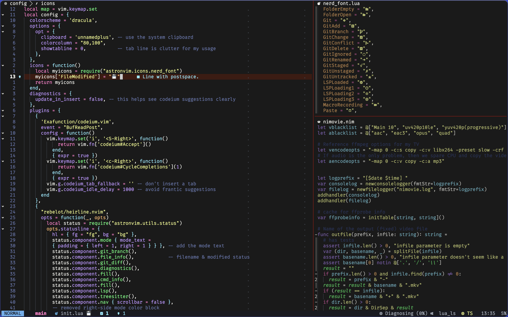

# Astronvim configuration

Requires [Astronvim](https://astronvim.com), obviously.

## Screenshot

## Features

- All Astronvim goodies
- Dracula color scheme with blood accents
- Reasonable window management (focus, tint) and keyboard navigation (jump2d)
- Support for Nim, lua(hammerspoon), fish, just
- Codeium AI suggestions
- "TODO" comment highlighting and navigation for code quality management
- etc.
